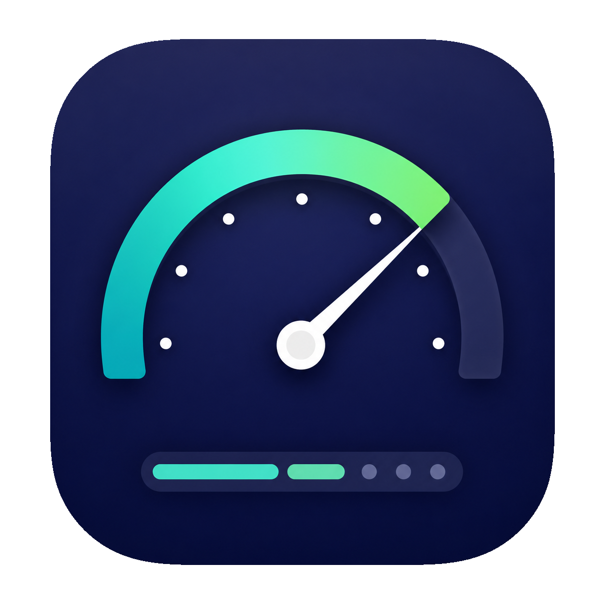
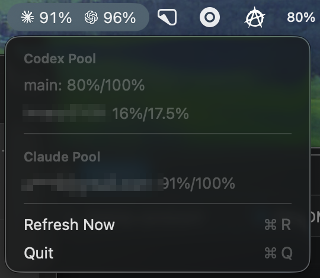

<p align="center">
  
</p>

# OpenCodex Quota Tray

Native macOS 14+ menu-bar app. Polls OpenCodex, pauses one exact Codex account
alias at its configured weekly threshold, and shows Codex and Claude pool
allowances.

[OpenCodex](https://github.com/lidge-jun/opencodex) is a local proxy that
multiplexes several Codex and Claude accounts behind one endpoint and tracks
their quota usage. This app sits in the macOS menu bar, polls that proxy, and
turns its per-account quota data into at-a-glance pool totals.



## Quota math

Target alias native allowance equals `PAUSE_THRESHOLD_PERCENT` (default `70`).
Every other account has `100` native allowance. Display converts all values to
Pro-equivalent units: `pro = 1`, `prolite = 0.25` because one Pro percentage
point equals four ProLite percentage points.

```text
native remaining = max(native allowance - weekly usage, 0)
Pro-equivalent value = native value * plan factor
tray = floor(sum(Pro-equivalent remaining))
```

Example:

```text
main (Pro): 0%/100%
workmate (ProLite): 4.25%/17.5%
tray: floor(0 + 4.25) = 4%
```

Tray total represents absolute Pro-equivalent allowance, not ratio. Multiple
accounts can therefore produce values above `100%`.

Missing weekly quota or unknown plan displays `—` and makes tray total `—`
rather than inventing capacity. Pause threshold comparison stays in each
account's native percentage; normalization changes display math only.

Claude converts OpenCodex's raw per-account Anthropic utilization to remaining
allowance. No plan conversion is applied:

```text
Claude remaining = max(100 - usage, 0)
Claude row = 5-hour remaining / 1-week remaining
Claude tray = floor(sum(5-hour remaining)) / floor(sum(1-week remaining))
```

For example, `3%` 5-hour utilization and `12%` weekly utilization displays as
`97%/88%`. Like Codex, each Claude pool total is absolute across accounts and
can exceed `100%`. A missing window displays `—` in only that slot.

## Configure

Finder-launched apps do not reliably inherit shell environment. Create:

```text
~/.config/opencodex-quota-tray/config.json
```

```json
{
  "targetAccountAlias": "workmate",
  "pauseThresholdPercent": 70
}
```

Environment variables remain supported and override config-file values.

Optional env:

| Variable | Default |
| --- | --- |
| `PAUSE_THRESHOLD_PERCENT` | `70` |
| `POLL_INTERVAL_MS` | `60000` |
| `REQUEST_TIMEOUT_MS` | `30000` |
| `OPENCODEX_BASE_URL` | `http://127.0.0.1:10100` |
| `OPENCODEX_HOME` | `$HOME/.opencodex` |

Alias matching is exact and case-sensitive. Missing or duplicate target alias
fails closed: no pause request is sent. Admin token is read once from
`${OPENCODEX_HOME:-$HOME/.opencodex}/admin-api-token`.

## Develop

```bash
swift test
swift run OpenCodexTray
```

Headless single check:

```bash
swift run pause-worker-once
```

## Build app

Local builds use an ad-hoc signature and do not contact Apple:

```bash
./scripts/build-app.sh
open dist/OpenCodexTray.app
```

Trusted direct distribution requires the local Developer ID identity and a
one-time Notary service Keychain profile:

```bash
xcrun notarytool store-credentials "YOUR_NOTARY_PROFILE" \
  --apple-id "YOUR_APPLE_ACCOUNT" \
  --team-id "YOUR_TEAM_ID"
```

Enter an app-specific password when prompted. Copy `.env.example` to `.env`
and replace its placeholders with your local signing identity and Keychain
profile. `.env` is ignored by Git.

The build reads only `SIGNING_IDENTITY` and `NOTARY_PROFILE` from `.env` as
literal values; it does not execute the file as shell code.

```bash
cp .env.example .env
NOTARIZE=1 ./scripts/build-app.sh
```

This signs, notarizes, staples, and verifies the release. The distributable
artifact is `dist/OpenCodexTray.zip`. Environment variables override values
loaded from `.env`.

Tray title shows Claude icon + remaining Claude pool `5h/1w` allowance, then
Codex icon + Pro-equivalent Codex pool percentage. Click it for separate
`Codex Pool` and `Claude Pool (5h/1w)` sections with per-account rows,
`Refresh Now`, errors, and `Quit`. `Launch at Login` registers the app through
macOS Service Management. If macOS requires approval, use
`Open Login Items Settings` from the tray menu. App has no Dock icon.

## License

MIT, see [LICENSE](LICENSE).

Bundled CodexBar provider icons are MIT-licensed by Peter Steinberger, see
[Sources/OpenCodexTray/Resources/CodexBar-LICENSE.txt](Sources/OpenCodexTray/Resources/CodexBar-LICENSE.txt).
